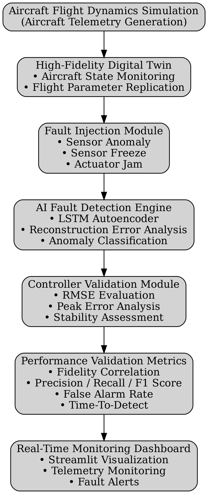
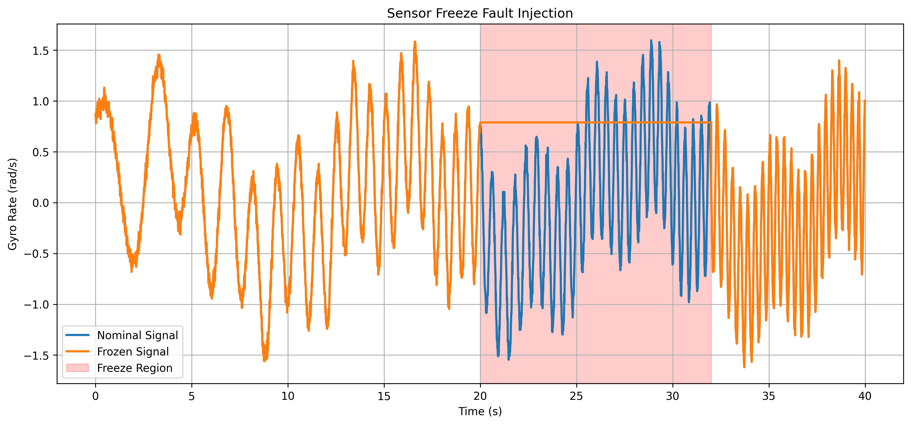
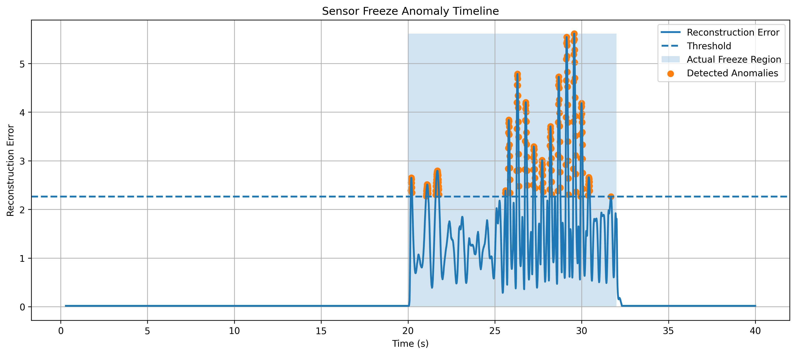
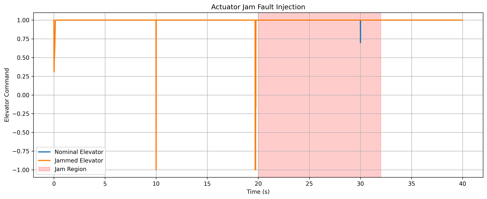
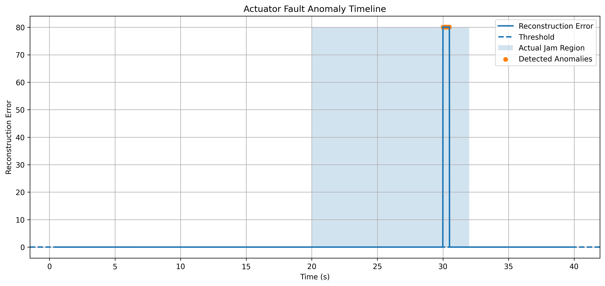
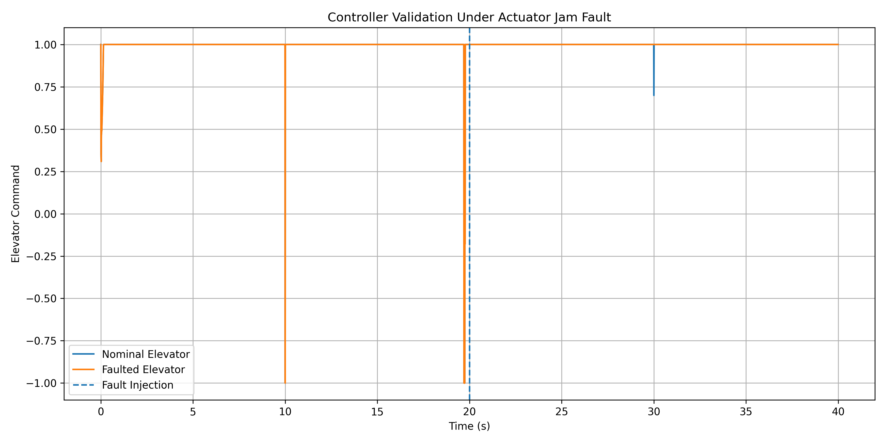
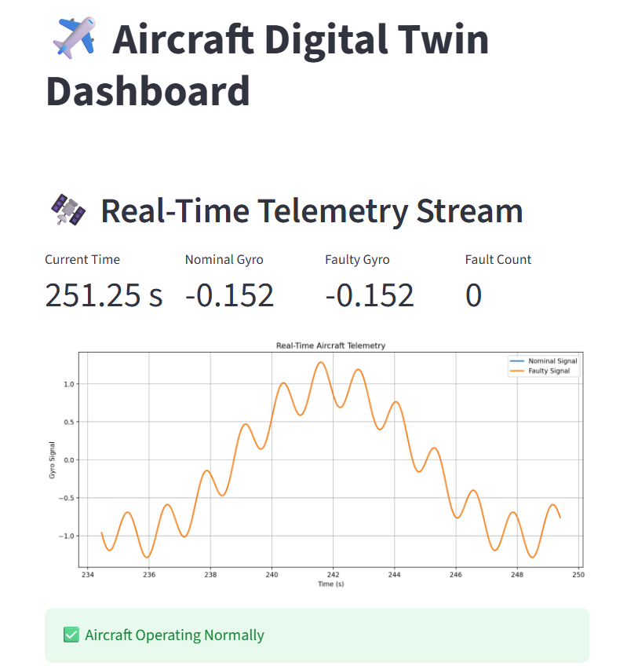

# Digital Twin for Aircraft Flight Control System Validation Using AI-Based Fault Detection

## Overview

This project presents a high-fidelity Digital Twin framework for Aircraft Flight Control System Validation. The system simulates aircraft telemetry, injects realistic sensor and actuator faults, applies AI-based anomaly detection using LSTM Autoencoders, validates controller performance, and provides real-time monitoring through a Streamlit dashboard.

The objective is to demonstrate how Digital Twin technology can be used for flight control verification, fault diagnosis, controller validation, and predictive maintenance applications in aerospace systems.

---

## System Architecture



---

## Key Features

- High-Fidelity Aircraft Digital Twin
- Aircraft Telemetry Simulation
- Sensor Anomaly Fault Injection
- Sensor Freeze Fault Injection
- Actuator Jam Fault Injection
- AI-Based Fault Detection using LSTM Autoencoders
- Reconstruction Error Analysis
- Controller Validation Framework
- Real-Time Monitoring Dashboard
- Automated Performance Evaluation

---

## Validation Results

### Digital Twin Fidelity

| Metric | Value |
|----------|----------|
| Correlation Coefficient | 0.8888 |
| RMSE | 0.6394 |

### Sensor Anomaly Detection

| Metric | Value |
|----------|----------|
| Precision | 0.810 |
| Recall | 1.000 |
| F1 Score | 0.895 |
| False Alarm Rate | 0.078 |

### Sensor Freeze Detection

| Metric | Value |
|----------|----------|
| Precision | 1.000 |
| Recall | 0.166 |
| F1 Score | 0.284 |
| False Alarm Rate | 0.0000 |
| Time-to-Detect | 0.17 s |

### Actuator Jam Detection

| Metric | Value |
|----------|----------|
| Precision | 0.962 |
| Recall | 0.042 |
| F1 Score | 0.080 |
| False Alarm Rate | 0.0007 |
| Time-to-Detect | 10.01 s |

### Controller Validation

| Metric | Value |
|----------|----------|
| RMSE | 0.004758 |
| Peak Error | 0.300902 |
| Steady-State Error | 0.000000 |

---

## Results

### Sensor Freeze Fault Injection



### Sensor Freeze Detection Timeline



### Actuator Jam Fault Injection



### Actuator Fault Detection Timeline



### Controller Validation



---

## Real-Time Monitoring Dashboard

The project includes a Streamlit-based monitoring dashboard for:

- Aircraft Telemetry Visualization
- Real-Time Fault Monitoring
- AI Fault Detection
- Controller Validation Metrics
- System Status Monitoring

### Dashboard Preview



---

## Demo Video

Watch the real-time dashboard demonstration:


---

## Repository Structure

```text
DigitalTwin_FCS/
│
├── data/
│
├── src/
│
├── ml/
│
├── dashboard/
│
├── docs/
│   └── images/
│       ├── architecture_diagram.png
│       └── dashboard.png
│
├── results/
│   ├── sensor_freeze_fault.png
│   ├── sensor_freeze_timeline.png
│   ├── actuator_jam_fault.png
│   ├── actuator_anomaly_timeline.png
│   ├── controller_validation.png
│   ├── final_validation_summary.txt
│   └── DigitalTwin_FCS_Final_Architecture.png
│
├── report/
│   └── DigitalTwin_FCS_Report.pdf
│
├── demo/
│   └── dashboard_demo.mp4
│
└── README.md
```

---

## Technologies Used

- Python
- NumPy
- Pandas
- PyTorch
- Scikit-Learn
- Matplotlib
- Streamlit

---

## Applications

- Flight Control System Validation
- Digital Twin Development
- Aircraft Fault Diagnosis
- Predictive Maintenance
- Aerospace AI Applications
- Controller Verification

---

## Author

Amaraneni Vinitha

B.Tech Aeronautical Engineering

Aircraft Systems • Flight Dynamics • Control Systems • AI for Aerospace
